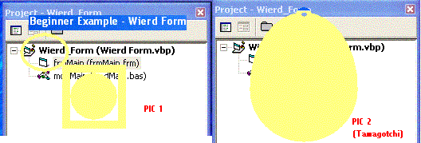



## Wierd Form

### Description

This simple example shows you how to create an irregular shapped form (see screenshot). You can choost from the sample, or click on the form to view the tamagotchi-shapped form! What shapes can you make? Send the code to me! Thanks!
 
### More Info
 

             |
---                |---
**Submitted On**   |2002-07-21 17:13:18
**By**             |[Mike Gerwitz](https://github.com/Planet-Source-Code/PSCIndex/blob/master/ByAuthor/mike-gerwitz.md)
**Level**          |Beginner
**User Rating**    |5.0 (20 globes from 4 users)
**Compatibility**  |VB 6\.0
**Category**       |[Miscellaneous](https://github.com/Planet-Source-Code/PSCIndex/blob/master/ByCategory/miscellaneous__1-1.md)
**World**          |[Visual Basic](https://github.com/Planet-Source-Code/PSCIndex/blob/master/ByWorld/visual-basic.md)
**Archive File**   |[Wierd\_Form1089737212002\.zip](https://github.com/Planet-Source-Code/mike-gerwitz-wierd-form__1-37149/archive/master.zip)

